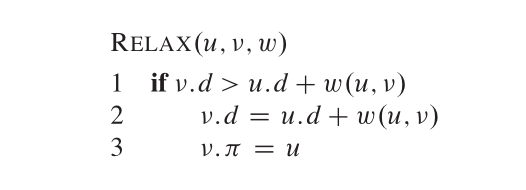
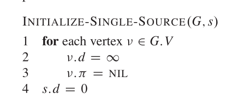
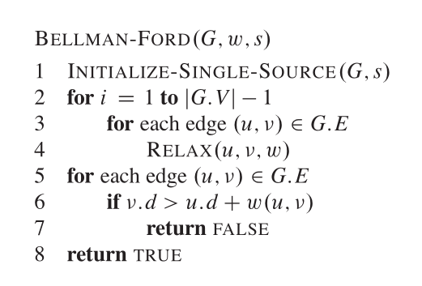
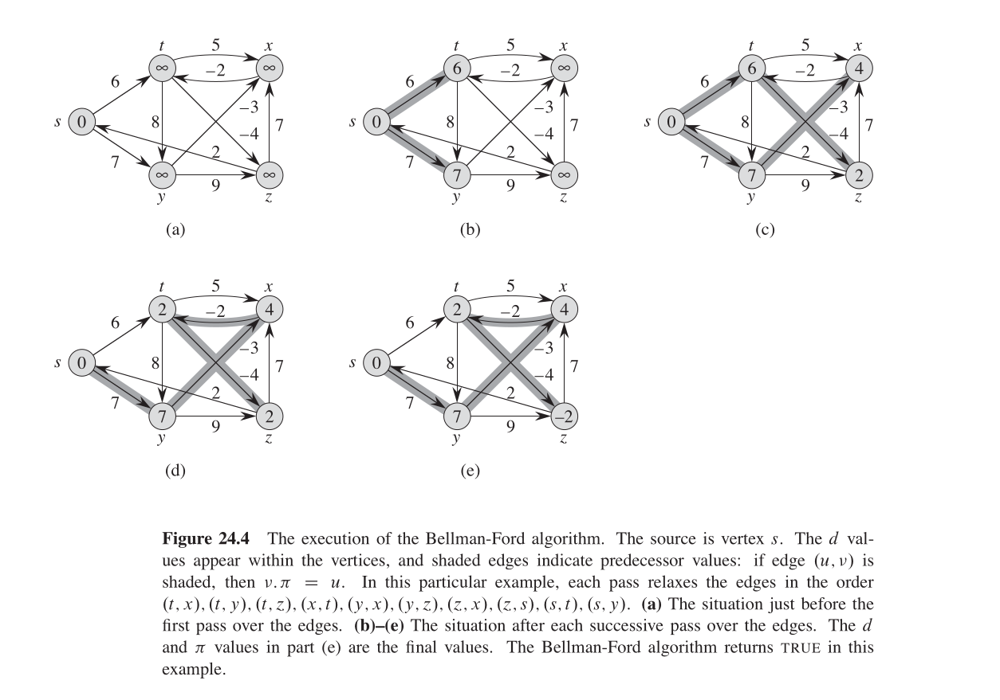

# Bellman Ford
This algorithm is capable of finding the shortest path from one node to the others, and is also able to tell us if there's a negative cycle in the graph. 
Its complexity is O(N * M), since for each node we'll be checking each edge and seeing if we are able to update the shortest path estimate to a smaller value.
Since there are other algorithms, like Dijkstra, which are able to find the shortest path with better time complexity, why is this algorithm useful?
Its strength lies in the fact that it can work with negative edges, and it's also able to detect negative cycles.

### HOW IT WORKS
We want to find the shortest path from one root node $v$ to the other nodes.
To do so, two important quantities are to be stored, that is:

$v.d$ : The current 'shortest-path estimate' for v

And

$v.\pi$ : the predecessor of the node v

The shortest-path estimate is the current best shortest path we have from the root node $v$ to the node $u \in E \setminus \{v\}$.

The idea of the algorithm is to 'relax' each node, that is, we want to tighten the triangle inequality constraint, which states that $v.d \leq u.d + w(u, v)$. We call it
 'relaxing' because each node is 'relaxed' while the algorithm executes (with respects to this constraint), and it will be set to the minimum it can be when the algorithm finishes.
 Should be called 'stressing' the constraint, that will be more intuitive, since we are decreasing the shortest-distance estimate $v.d$, but for historic reasons is called 'relaxing'.

We want to set all the distances from the root node $v$ to the rest of the nodes to $\infty$, because when we start comparing, we want the first distances we check to always 
be better of what we have in the beginning, since at the beginning we know nothing about those distances. The distance from the node to itself will be set to 0 in the implementation. At the beginning of the algorithm, the predecessors will be set to null (I use -1 in the implementation, since there are no negative nodes, this means there's no predecessor), since there are no predecessors before running the algorithm. Actually, we know one: the predecessor of the root $v$ node is itself: $v.\pi = v$.

Here's the algorithm

We relax each node, that is, we check for all the edges that comes and goes from the node, and see if we can update the shortest-distance estimate $d$
to a smaller value. 

If the edge we happen to check is an incoming edge, we check if what we have, $v.d$, is better than what the $u.d$ plus the weight $w(u, v)$ is offering us. 
If so happens that $v.d < u.d + w(u, v)$, then what we have is worse, and we set the shortest-distance estimate for v to $v.d = u.d + w(u, v)$.
We also update the ancestor $v.\pi$ to $v.\pi = u$, since we will be taking that shortest path now.

If the edge we happen to check is an outgoing edge, we check if what we can offer to our neighbor is better than what they currently have. 
If $u.d < v.d + w(v, u)$, then what we can do is better, and we update the shortest-distance estimate for $u$ to $u.d = v.d + w(v, u)$.
We also update the ancestor $u.\pi$ to $u.\pi = v$, since we will be taking that shortest path now.

### Checking for negative cycles
To detect negative-weight cycles, we examine each node $i$ and its predecessor $i.\pi$. If performing an additional relaxation — i.e., traversing from the predecessor to node 
$i$ using the edge weight still results in a shorter path estimate from the source to $i$, this indicates the presence of a negative-weight cycle. Such a cycle would cause the path estimate to decrease indefinitely with each additional relaxation, violating the assumption of shortest-path stability.

### Example
In the implementation, I use the example provided in the book 'Introduction to Algorithms' - Thomas H. Cormen. Here it is:

