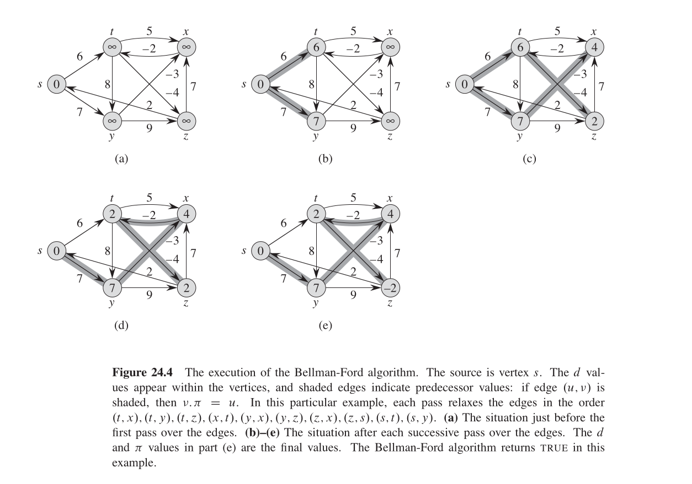
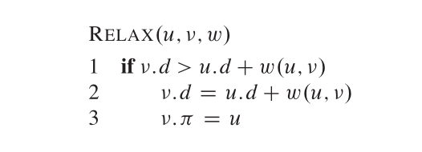
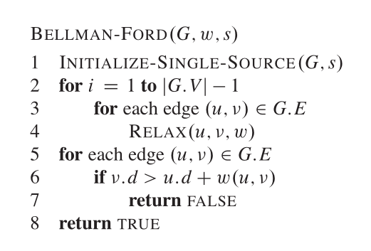

# Shortest-path-algorithms
Implementation of famous algorithms for finding the shortest path between nodes in a graph

## Bellman Ford
This algorithm is capable of finding the shortest path from one node to the others. Its complexity is O(N * M), since for each node, we'll be checking each edge
and seeing if we are able to update the shortest path estimate to a smaller value.

In the implementation, I use the example provided in the book 'Introduction to Algorithms' - Thomas H. Cormen. Here it is:

### HOW IT WORKS
We want to find the shortest path from one root node $v$ to the other nodes.
To do so, two important quantities are to be stored, that is:

$d$ : The 'shortest-path estimate'

And

$v.\pi$ : the predecesor of the node v

The shortest-path estimate is the current best shortest path we have from the root node $v$ to the node $u \in E \setminus \{v\}$.

The idea of the algorithm is to 'relax' each node, that is, we want to tighten the triangle inequality constraint, which states that $v.d \leq u.d + w(u, v)$. We call it
 'relaxing' because each node is 'relaxed' while the algorithm executes (with respects to this constraint), and it will be set to the minimun it can be when the algorithm finishes.
 Should be called 'stressing' the constraint, that will be more intuitive, since we are decreasing the shortest-distance estimate $v.d$, but for historic reasons is called 'relaxing'.

Here's the algorithm

We relax each node, that is, we check for all the edges that comes and goes from the node, and see if we can update the shortest-distance estimate $d$
to a smaller value. 

If the edge we happen to check is an incoming edge, we check if what we have, $v.d$, is better than what the $u.d$ plus the weight $w(u, v)$ is offering us. 
If so happens that $v.d < u.d + w(u, v)$, then what we have is worse, and we set the shortest-distance estimate for v to $v.d = u.d + w(u, v)$.
We also update the ancestor $v.\pi$ to $v.\pi = u$, since we will be taking that shortest path now.

If the edge we happen to check is an outgoing edge, we check if what we can offer to our neighbor is better than what they currently have. 
If $u.d < v.d + w(v, u)$, then what we can do is better, and we update the shortest-distance estimate for $u$ to $u.d = v.d + w(v, u)$.
We also update the ancestor $u.\pi$ to $u.\pi = v$, since we will be taking that shortest path now.
